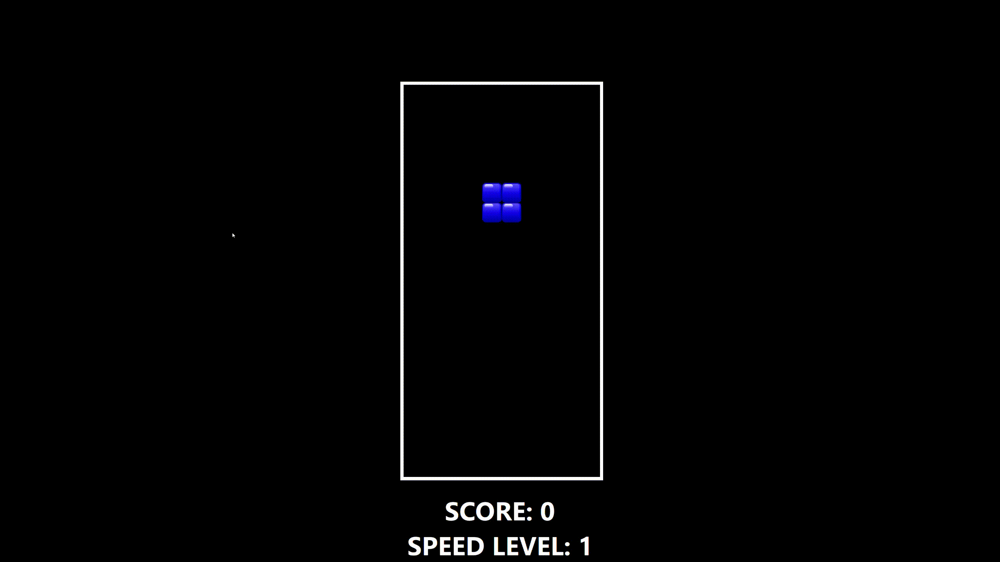

# Tetris

C++ implementation of the classic Tetris game using Qt 6.9.2.

Frontend is rendered using QML engine.

**Windows executable is provided.**

## Play online

You can play the WebAssembly build here:

https://adam-choragwicki.github.io/games/tetris/index.html

## Controls

| Key | Action |
| --- | --- |
| **Left Arrow** / **A** | Move block left |
| **Right Arrow** / **D** | Move block right |
| **Down Arrow** / **S** | Soft drop |
| **Up Arrow** / **W** | Rotate block |
| **Space** | Hard drop |
| **Escape** | Open escape menu |
| **F11** | Toggle fullscreen |

## Changing speed level

During the game, press **Escape** to open the escape menu, then choose **Change Game Parameters** to change the speed level.

## Tests

Unit tested using Google Test 1.17.0

## How to run on Windows

1. Download release zip from:  
   https://github.com/adam-choragwicki/Tetris_Game_Qt_Cplusplus_QML/releases/latest/download/executable_windows.zip
2. Unzip
3. Run **executable_windows/Tetris.exe**
